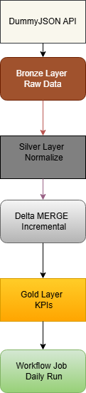

# databricks-data-engineering-pipeline

# End-to-End Data Engineering Pipeline using Databricks

## Overview

This project demonstrates an end-to-end batch data engineering pipeline built on Databricks using a Medallion Architecture (Bronze, Silver, Gold).

The pipeline ingests product data from a structured REST API, stores raw data in a Bronze layer, transforms and normalizes nested JSON into Silver tables, performs incremental updates using Delta Lake MERGE, and creates Gold analytical tables for business reporting.

The pipeline is orchestrated using Databricks Workflows and scheduled for daily execution.

---

## Architecture





### Pipeline Flow

```text
DummyJSON API
       ↓
Bronze Layer (Raw Ingestion)
       ↓
Silver Layer (Normalization)
       ↓
Incremental Load (Delta MERGE)
       ↓
Gold Layer (Business KPIs)
       ↓
Databricks Workflow (Daily Scheduling)
